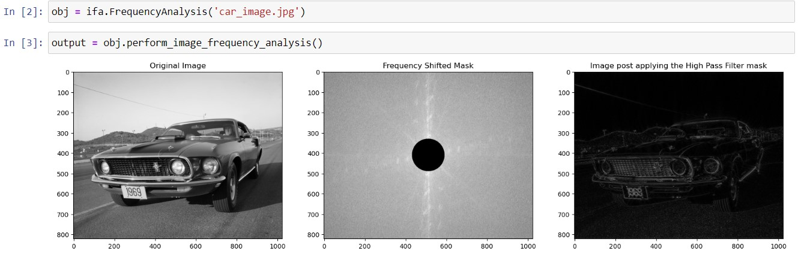
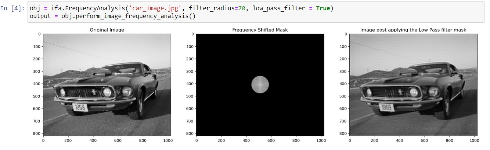

<h1> Image Frequency Analysis </h1>
  

This package is build to combine all the steps that are done as part of the
frequency analysis using the Fourier transform approach.

## Install the Package
You can install the package using the pip command

`!pip install image_frequency_analysis` - when installing through jupyter notebook

`pip install image_frequency_analysis` - when installing through a command prompt

## Using the package
Once you have installed you can use the package by importing the image_frequency_analysis method from the package

` import image_frequency_analysis as ifa `

You can then pass the image path to the function which is a required argument, to get the plot 
of comparison between the original image and the filtered image

**Example:**

`obj = ifa.FrequencyAnalysis('car_image.jpg')`

`output = obj.perform_image_frequency_analysis()`

By default the package uses the high pass filter to perform the filtering of the image. This option can be overridden using
the optional parameters that can be sent to the function.

You can find the various optional parameters and their usage in the package using the help command.

` help(ifa.FrequencyAnalysis) ` or looking through the docstring directly in the IDE

## Sample Output

**Output with default parameters**

**Output with Modified Parameters**

